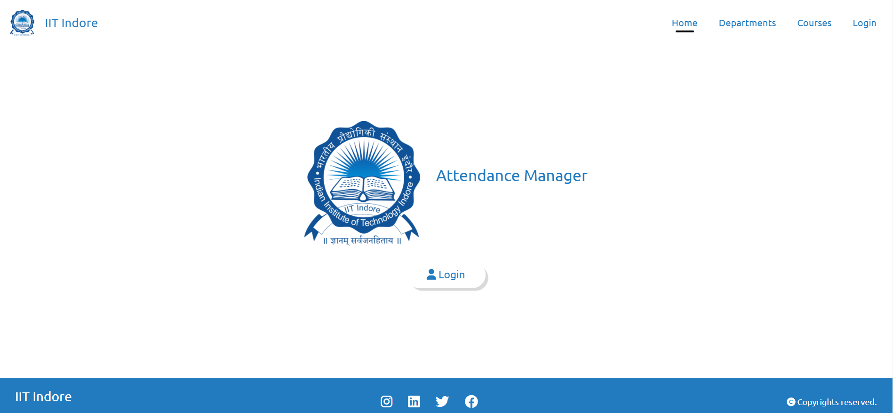

# Attendance_Marking_System
Attendance Marking System via ML face recognition modules/libraries

The prime intutiton behind developing this project is to save the minutes in the lecture hours or other relevant activities in educational institutions, during the process of noting the attendance of students.

#### Run the project in local environment 
Clone the github repository through the following command : https://github.com/bgvshiva2004/Attendance_Marking_System.git

## Team 
* B.G.V.Shiva   : 220002029 / CSE / IIT INDORE
* A.Pavan Kumar : 220001011 / CSE / IIT INDORE
* A.Sumanth     : 220001010 / CSE / IIT INDORE

## Web Interface

#### Web Workflow
The authorised users with valid login credentials would be able to login into the web and further gives the class group photo as the input image besides mentioning the Course Id, date and the class.
The students' attendance present in the input image is marked as 'present' and further the option of downloading the respective attendance file is also availed.  
  
## Prerequisites
#### Machine Learning
* Python
* Insightface
#### Front-end
* HTML
* CSS
* JS
#### Back-end
* Django

## Installations and Imports 
#### Installing Dependencies
* pip install numpy
* pip install opencv-python
* pip install insightface
* pip install mtcnn
* pip install onnxruntime
#### Imports
* from typing import list
* import logging
* import numpy as np
* import cv2
* from PIL import image
* from mtcnn import MTCNN
* import insightface
* import math
* import pickle
* import json
* from sklearn.metrics.pairwise import cosine_similarity
* import os

## Features
### User Friendly Interface
* The authorised user (professor) avails the ability of managing/updating departments, courses information in a user friendly interface.
* User, after uploading the class image, the faces of the students present in the image are recognised through comparision with the (embeddings extracted from the) pre exisiting database and their attendance is marked 'present'.
### Downloadable Attendance in csv (excel) format
* The attendance computed from the model in the backend, is stored in a csv file where the corresponding attendance slot of the students present is marked as '1' whil the absentees' as '0'.

